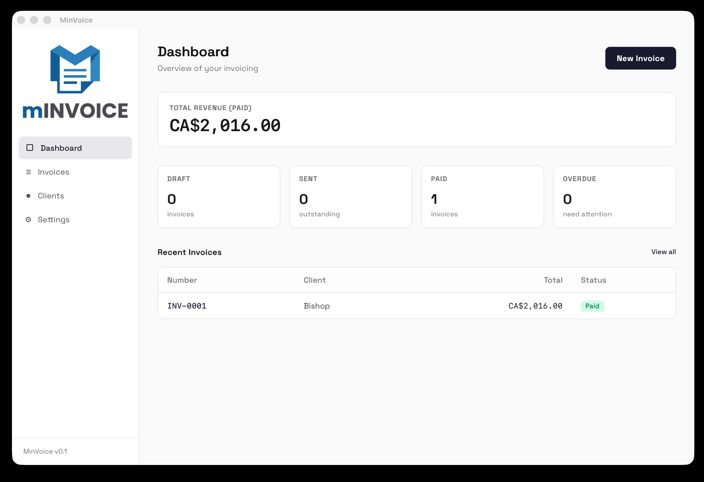
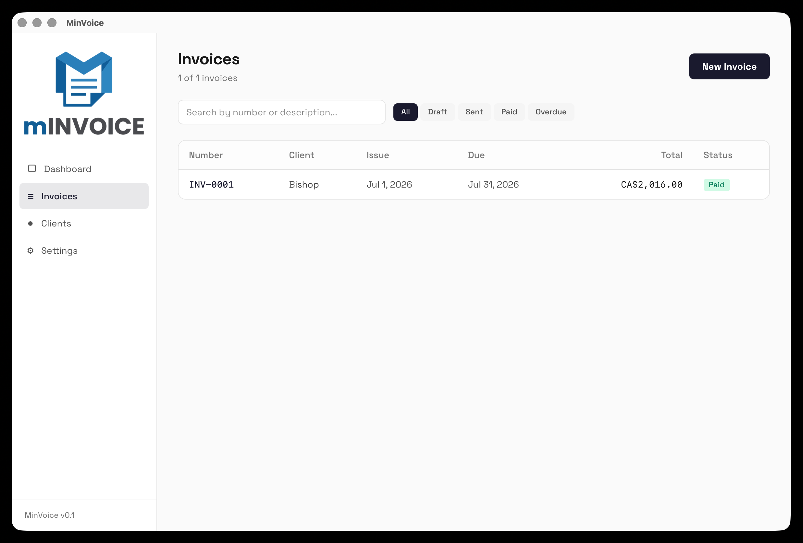
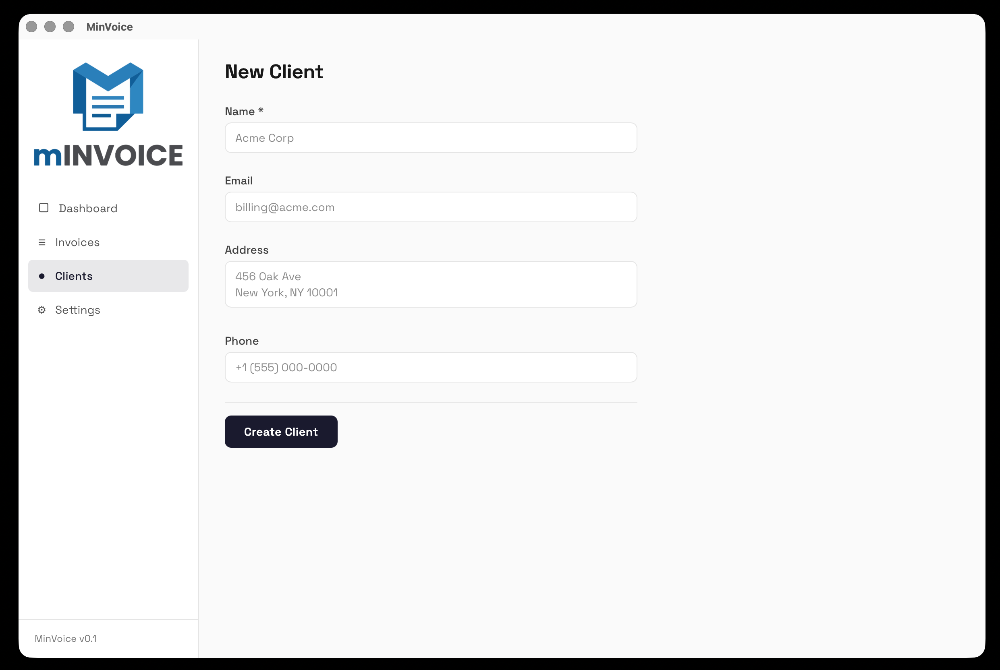
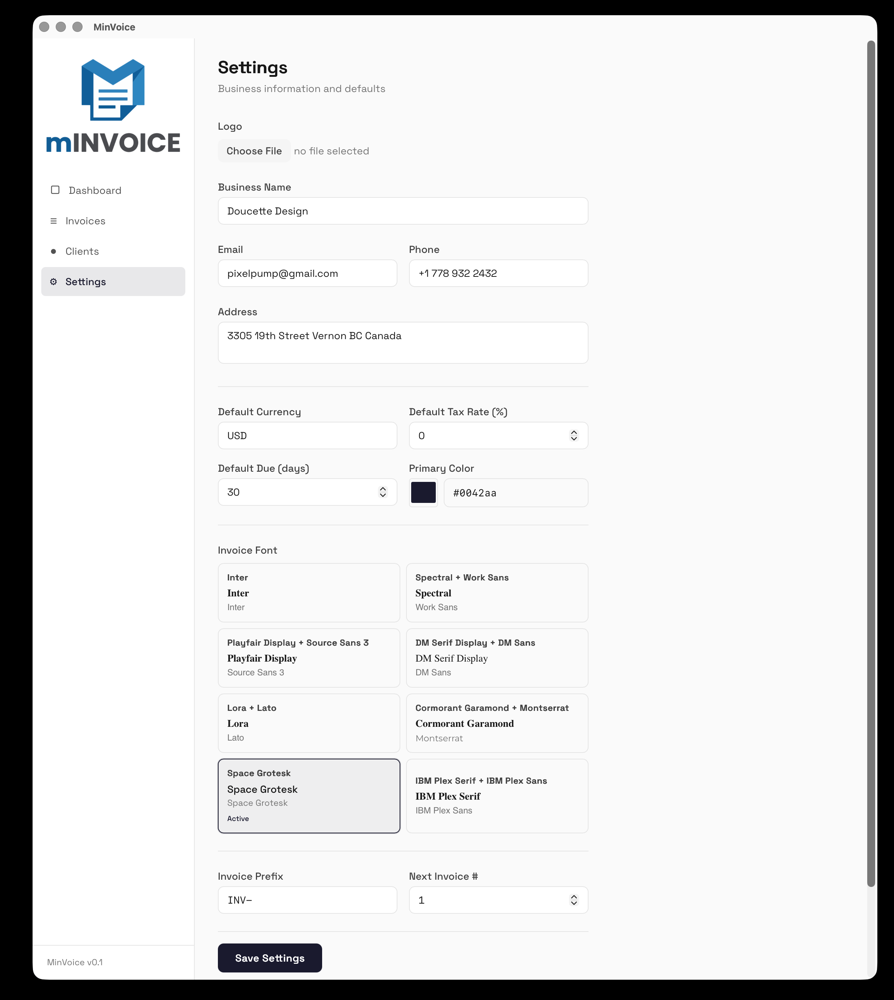

# MinVoice

A minimal, local-first invoicing app. Create professional invoices, manage clients, generate PDFs, and share invoices via link — all from your browser or desktop. No server, no signup, no cloud dependency.

## Features

### Dashboard



- Total revenue from paid invoices
- Status breakdown cards (draft, sent, paid, overdue)
- Recent invoices table with quick links
- Setup reminder until business profile is configured

### Invoices


- Create and edit invoices with live subtotal, tax, discount, and total
- Line items with description, quantity, unit price, and per-line tax %
- Line item history auto-complete for faster entry
- Configurable invoice number prefix and auto-increment counter
- Customizable issue and due dates
- Internal notes field
- Save as draft or save & mark as sent

### Invoice Viewing & Sharing
- Full HTML invoice preview (responsive, print-ready)
- One-click PDF download with embedded fonts and logo
- Quick status changes (draft → sent → paid → overdue)
- **Share via link** — lz-string compressed URL encodes the full invoice, client, and business data; no auth required, no server dependency
- Copy share link to clipboard
- Print directly from the browser

### Client Management



- Create, edit, and delete clients
- Name, email, address, and phone fields
- Delete protection — clients with linked invoices cannot be removed

### Settings


- **Invoice defaults**: currency, tax rate, due days, invoice prefix, next number
- **Appearance**: primary color picker and 8 font pairings with live preview
- **Data management**: export all data as JSON backup, import to restore

### Local-First Storage
- All data stored in IndexedDB via Dexie.js — fully offline
- No accounts, no cloud, no server

### Desktop App
- Optional Tauri v2 native builds for macOS, Windows, and Linux

## Tech Stack

| Layer       | Technology                           |
|-------------|--------------------------------------|
| Frontend    | React 19, TypeScript 6               |
| Routing     | React Router v7 (HashRouter)         |
| Build       | Vite 8                               |
| Styling     | Tailwind CSS 4                       |
| Database    | Dexie.js 4 (IndexedDB)               |
| PDF         | jsPDF 4                              |
| Share URLs  | lz-string (compression)              |
| Desktop     | Tauri v2                             |
| Linting     | oxlint                               |

## Getting Started

### Prerequisites
- Node.js 18+
- npm

### Install

```bash
git clone https://github.com/pixelpump/MinVoice.git
cd MinVoice
npm install
```

### Development

```bash
npm run dev
```

Opens at `http://localhost:5173`.

### Build

```bash
npm run build      # TypeScript check + Vite production build → dist/
npm run preview    # Preview the production build locally
npm run lint       # Run oxlint
```

## Deployment

### Static Web Hosting

The app builds to static files in `dist/`. Deploy anywhere:

**Vercel / Netlify / Cloudflare Pages:**
- Build command: `npm run build`
- Output directory: `dist`

**GitHub Pages:**
```bash
npm run build
npx gh-pages -d dist
```

**Any static server:**
```bash
npm run build
npx serve dist
```

> The Vite config uses `base: './'` so the app works at any path.

### Desktop App (Tauri v2)

Build native desktop apps with Tauri:

```bash
npm run tauri:dev     # Development with hot-reload
npm run tauri:build   # Production build (macOS .dmg, Windows .msi, Linux .deb/.AppImage)
```

Requires the [Tauri prerequisites](https://v2.tauri.app/start/prerequisites/) for your platform (Rust, system dependencies).

## Project Structure

```
src/
├── components/
│   ├── clients/       # ClientForm
│   ├── invoices/      # InvoiceForm, InvoiceList, InvoicePDF, LineItemRow
│   ├── layout/        # Shell, Sidebar
│   └── shared/        # ConfirmDialog, EmptyState, StatusBadge
├── hooks/             # useClients, useInvoices, useSettings, useSearch, useLineItemHistory
├── lib/               # db.ts (Dexie), pdf.ts (jsPDF), fonts.ts, share.ts, types.ts, utils.ts
├── pages/             # All routed page components
├── App.tsx            # Router + Shell layout
├── main.tsx           # Entry point
└── index.css          # Tailwind + CSS custom properties

public/                # Favicons, manifest, logo assets, icons sprite
screenshots/            # App screenshots
```

## License

MIT
